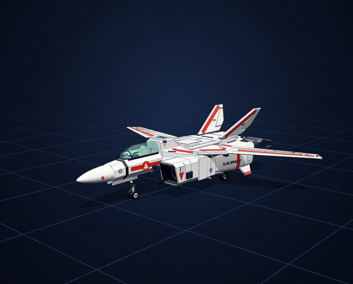
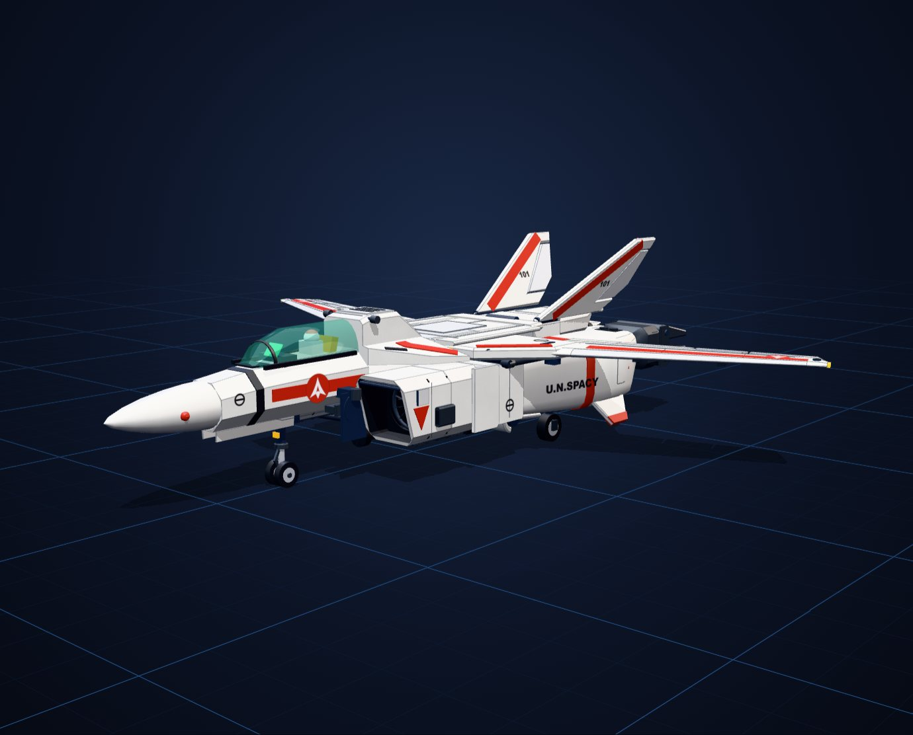
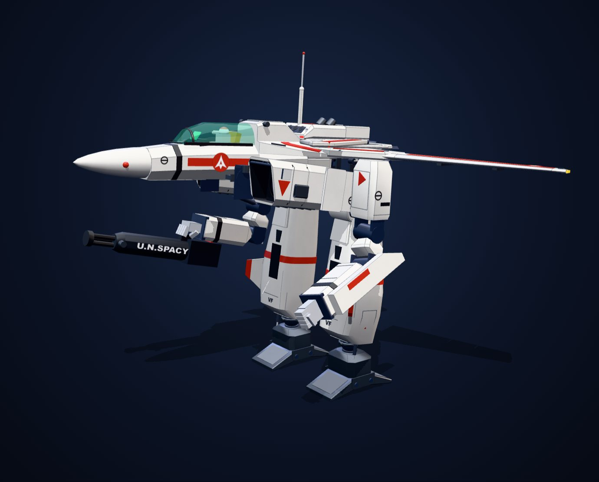
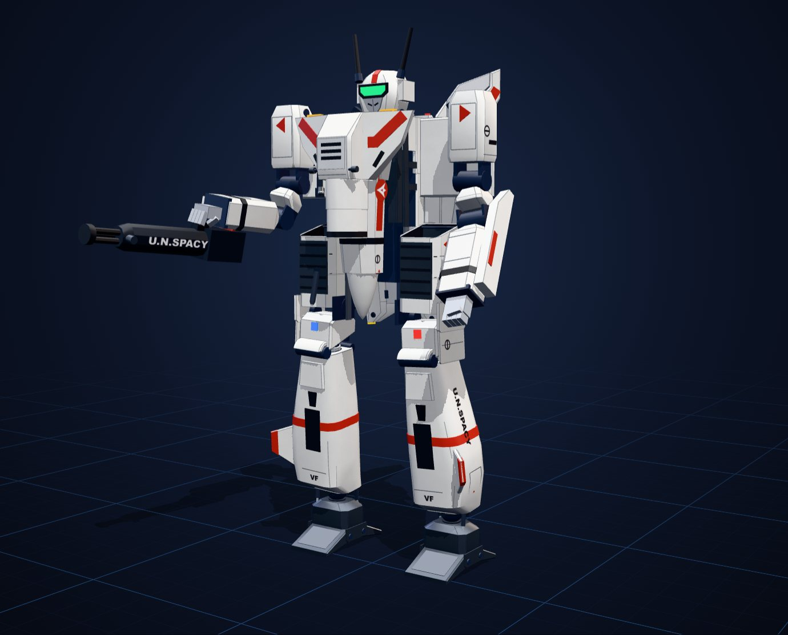
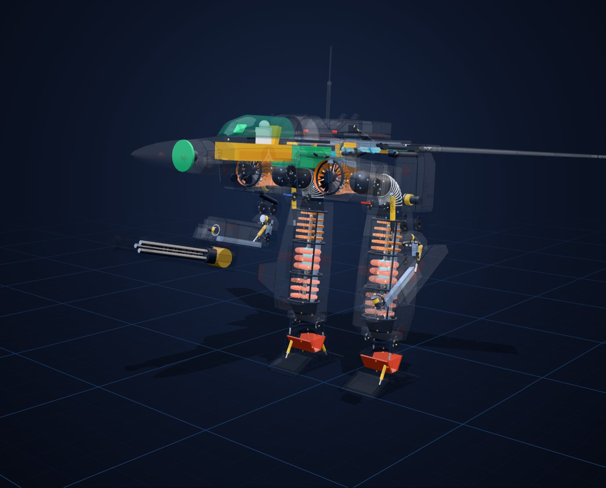
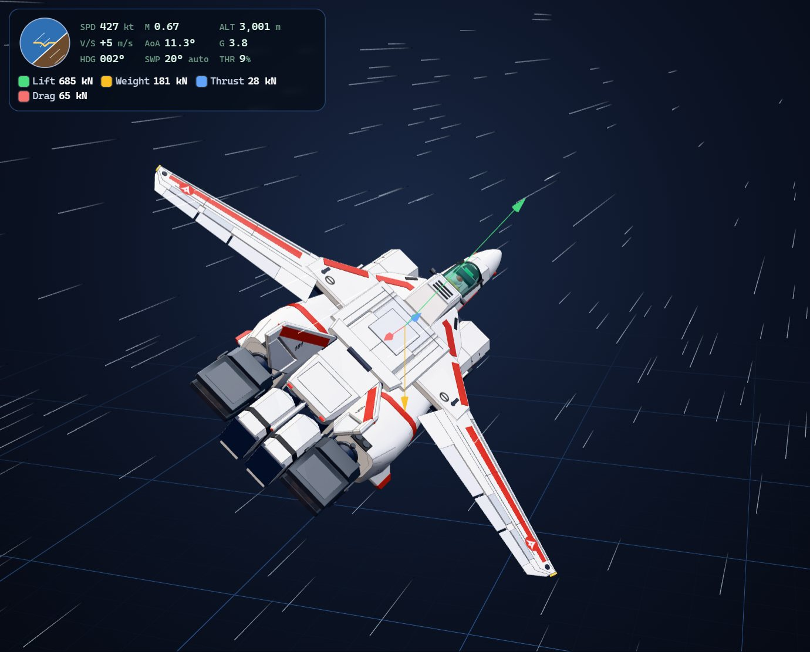
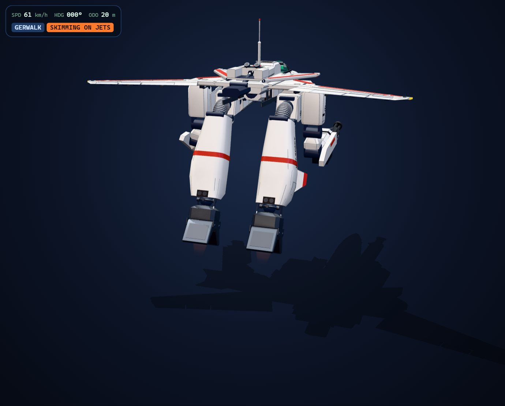

<p align="center">
  
</p>

<h1 align="center">MechDeck</h1>

<p align="center">
  <b>一个在浏览器里运行的交互式 3D 可变形机甲机库。</b><br>
  在真实的骨骼绑定上，让 VF-1J 女武神变形、试飞、驾驶，并用 X 光透视它的内部。
</p>

<p align="center">
  <a href="https://mechdeck.vercel.app"></a>
  <a href="LICENSE"></a>
  
  
  
</p>

<p align="center"><a href="README.md">English</a> · <b>简体中文</b></p>

<p align="center">
  
</p>

MechDeck 完全在浏览器中运行。你可以 360° 旋转查看 **VF-1J 女武神**，在真实的骨骼绑定上让它在战机（Fighter）、GERWALK 与人形（Battroid）三种形态之间变形；用 X 光透视查看引擎和作动器；用飞行模型驾驶它飞行；或者操纵它在机库地面上行走。

**[打开在线演示 →](https://mechdeck.vercel.app)** 这是一个纯静态网站，没有后端，也不需要任何 API 密钥，桌面端和触屏设备都能运行（只需一个支持 WebGL2 的浏览器）。基于 React、three.js 和 react-three-fiber 构建。VF-1J 是机库中的第一台机体，之后还可以加入更多机体（见[添加机体](#添加机体)）。

MechDeck 是同人作品，与 Studio Nue / Big West 无关。

## 画廊

| 战机形态（Fighter） | GERWALK | 人形形态（Battroid） |
| :---: | :---: | :---: |
|  |  |  |
| **解剖透视** | **飞行实验室** | **驾驶模式** |
|  |  |  |

这里的每张图都是应用的实时渲染，由 `scripts/readme-media.mjs` 生成。

## 功能

- **变形：** 在真实的骨骼绑定上实现战机 ⇄ GERWALK ⇄ 人形的变形，每个关节的时序都依照官方变形设定图。腿部在膝盖处放下，背部组件升起成为减速板后翻倒在背上，双臂向后滑出、展开、回转并下摆，接过 GU-11 枪舱。碰撞测试保证在变形过程中每隔 1% 的进度，所有刚体都互不穿插。
- **线稿精度：** 比例依据官方 VF-1A 五视图（全长 14.23 m）、人形形态设定图（全高 12.68 m）和 MAHQ 的 VF-1J 设定图测量：
  - 垂直尾翼外倾 22.5°，平面形状按测量绘制；
  - F-14 式斜切二元进气道：两块可调斜板和一扇旁路放气门（在飞行实验室中随机翼后掠角调度），风扇面位于扩压段末端的深处；
  - GU-11 枪舱挂在全机最低处；
  - 战机形态停放在机头起落架和主起落架上；
  - GERWALK 形态的背部组件平躺在座舱后方，与模型套件一致。
- **解剖透视：** X 光剖视图，包含八个可单独开关的系统：
  - FF-2001 引擎：旋转的风扇、压气机和涡轮级，以及发光的反应堆。一条风道从风扇不间断地通到压气机，经过髋部的球形旋转接头和绕膝盖弯曲的波纹管（GERWALK 形态下可在大腿与小腿之间看到）。气流粒子在其中流动，引擎转速越高流得越快。
  - 二元喷口
  - 航电
  - 座舱
  - 液压系统与关节齿轮组
  - 动力核心
  - 骨架
  - 武器
- **关节与枢轴：** 关节运动时，每个铰链（在其真实转轴上）都会亮起一个圆环，每条滑轨都会亮起一个箭头。
- **关节控制：** 为 GERWALK 和人形形态逐个关节地摆姿势；每个关节在第一次接触时就会停下，任何姿势都不会让部件互相穿插。
- **驾驶模式：** 在机库地面上操纵 GERWALK（步行，或借脚部喷射贴地滑行）或人形形态（步行、以最高 160 km/h 奔跑、借助游标推进器跳跃）。支持键盘或触屏摇杆，配有追随镜头和 HUD。
- **飞行实验室：** 用物理模型驾驶战机形态飞行。模型包含升力、阻力、推力和重力，电传操纵的过载指令控制律，按马赫数调度的可变后掠翼，以及 VF-1 真实的操纵方式：推力矢量控制俯仰，扰流板加翼尖推进器控制滚转（没有副翼和水平尾翼），还有方向舵、前缘缝翼、富勒襟翼与两段式外侧襟翼，以及背部减速板。界面上有 HUD、受力矢量，以及随空速变化的相对气流线。
- **音效：** 用 Web Audio API 实时合成（没有任何音频文件）：
  - 变形时的伺服电机声和锁止撞击声；
  - 涡轮啸叫与喷气轰鸣；
  - 脚步声、起跳喷射声和落地声。
- **部件检视：** 点击任意部件，或搜索英文部件名（如 "left engine"、"aileron"、"reactor"），镜头会飞到该部件。
- **工程校验：** 测试保证在变形、步行、飞行以及每个关节的全部活动范围内，所有物体（装甲、内部构件、作动筒、连杆）互不穿插，每个部件始终连接在机体上，每根作动筒始终保持啮合（既不会被拉脱，也不会顶死），每根连杆保持刚性。

本仓库不包含任何官方美术、模型或音频：几何体由代码程序化生成，涂装是无贴图的着色器，音效为实时合成。

## 操作方式

| | |
| --- | --- |
| 查看 | 拖动旋转视角 · 滚轮或双指缩放 · 右键拖动或双指平移 · Home 按钮复位视角 |
| 驾驶模式 | W/S 或 ↑/↓ 前进后退 · A/D 或 ←/→ 转向 · Q/E 侧移 · Shift 奔跑或贴地滑行 · 空格跳跃（手机上用触屏摇杆） |
| 飞行实验室 | W/S 或 ↑/↓ 俯仰（后拉抬头）· A/D 或 ←/→ 滚转 · Q/E 方向舵 · Shift/Ctrl 或 =/- 油门 · F 襟翼 · B 减速板 · V 自动后掠 · [ / ] 手动调节后掠角 |
| 音效 | 首次点击或按键前保持静音 · 按 M 键或扬声器按钮静音 |

## 运行

```bash
npm install
npm run dev          # 本地开发服务器
```

开发环境为 Node 24。`npm run build` 会先做类型检查，再把静态网站输出到 `dist/`，任何静态托管都能部署（仓库中已包含 Vercel 的 `vercel.json`）。

| 命令 | 作用 |
| --- | --- |
| `npm run dev` | 本地开发服务器 |
| `npm run build` | 类型检查 + 生产构建 |
| `npm run preview` | 在 `http://localhost:4173` 上预览生产构建 |
| `npm test` | 单元测试（Vitest）：运动学、碰撞、连接性、作动筒、飞行模型、UI 状态 |
| `npm run e2e` | Playwright 端到端测试，桌面 1440×900 与手机 390×844（使用系统中的 Chrome） |
| `npm run shots` | 按预设视角截图（需先运行 `npm run preview`） |
| `npm run flightcheck` | 自动飞一段飞行实验室航程并截图（同上） |
| `node scripts/livecheck.mjs <url>` | 对已部署的版本做桌面端和手机端的冒烟测试 |
| `node scripts/readme-media.mjs` | 重新渲染 README 中的 GIF 和画廊（需要 `npm run preview` 和 ffmpeg） |

## 架构

```text
src/core/            与具体机体无关的通用机制
  types.ts           应用与机体之间的 MechDefinition / MechRuntime 接口
  builder.ts         把网格挂到骨骼上；描边、面板线、部件登记
  collisions.ts      三角形级穿插检测（BVH），可声明设计上允许的接触
  connectivity.ts    证明每个部件始终连接在机体上
  jointGuard.ts      让关节在第一次接触时停下
  jointOverlay.ts    关节运动时发光的铰链圆环 / 滑轨箭头
  flight/            国际标准大气（ISA）+ 带电传控制律的质点飞行模型
  drive/             驾驶模式的地面运动（步行 / 奔跑 / 跳跃 / 贴地滑行）
  geometry/          放样、NACA 翼型切片、齿轮、叶片转子级等
  materials/         无贴图的涂装变化着色器
src/mechs/
  index.ts           机库登记表（MECHS）
  vf1j/              VF-1J 的全部内容：骨骼、姿态、部件、操纵面、气动参数、测试
src/scene/           画布、相机、飞行模拟、驾驶模式、音景、输入
src/audio/           Web Audio 合成器和音效提示
src/ui/              应用外壳、面板、HUD、搜索
src/state/store.ts   场景与 UI 共用的 zustand 状态
e2e/                 Playwright 测试
scripts/             截图、冒烟测试、README 媒体和精度工具
docs/media/          README 中的 GIF 和画廊
```

### 添加机体

1. 新建 `src/mechs/<id>/`，导出一个 `MechDefinition`（见 `src/core/types.ts`），包含以下字段：
   - 名称、简介和署名
   - `modes`（0…1 变形时间轴上的命名节点）
   - `systems` 和 `parts`（驱动解剖列表、部件检视和搜索）
   - `specs`
   - `frameRadius`
   - 可选的 `airframe`（用于启用飞行实验室）
   - `create()`，返回一个 `MechRuntime`
2. 仿照 `vf1j/` 构建运行时：由骨骼表生成骨骼，用核心的 `Builder` 放置部件，再写一个实现 `MechRuntime` 的控制器。
3. 把它加入 `src/mechs/index.ts` 中的 `MECHS`。机库菜单、状态、搜索、相机和面板都会自动接入。
4. 照搬 VF-1J 的测试模式：每种形态对照官方尺寸、不跳变、不陷入地面，整个时间轴上零碰撞。会飞的机体还要按公开的性能数据校准气动参数。

## 精度与资料来源

飞行模型：以下公开数据作为校准目标，并由测试强制保证。

- 起飞重量 18.5 t
- 推力 2 × 11,500 kgf（超推力模式下 23,000 kgf）
- 高度 10,000 m 时 2.71 马赫，30,000 m 以上时 3.87 马赫
- 过载 +7 g
- 机翼后掠角 20°–72°

资料来源：Macross Compendium 与 MAHQ。

估算值：

- 机翼面积（由 F-14 按翼展平方缩放而来）
- 气动系数
- 推力随高度的衰减，经校准使模型同时复现两个公开的最高速度

襟翼与后掠角的联锁、250 节时襟翼的自动收回，以及后掠角超过 57° 时锁定扰流板，都参考了 F-14 的做法（数值为近似值），并非来自 VF-1 的资料。

外形：`scripts/score.mjs` 和 `scripts/compare.mjs` 会把模型轮廓与官方线稿对比（同比例下的重叠度与叠图）。线稿受版权保护，不包含在本仓库中：请把你自己的副本放进 `shots/ref/`（已被 git 忽略），所需的文件名见脚本中的 `VIEWS` 表。

## 参与贡献

欢迎提交 Issue 和 Pull Request。提交 Pull Request 前，请运行 `npm run build`、`npm test` 和 `npm run e2e`。几何测试有意设计得很严格：在变形的任何一步，部件都不能穿插、悬空或脱开，所以修改某个部件时，通常需要让碰撞、连接性和作动筒测试继续保持通过。

## 许可证与致谢

代码以 [MIT 许可证](LICENSE) 发布，© 2026 Teh Bing Quan。

MechDeck 是同人作品。《超时空要塞》（Macross）、VF-1 女武神及其设计归 Studio Nue / Big West 所有；本项目与其无关，MIT 许可证只涵盖本仓库中的代码和原创内容，不包括这些设计。
